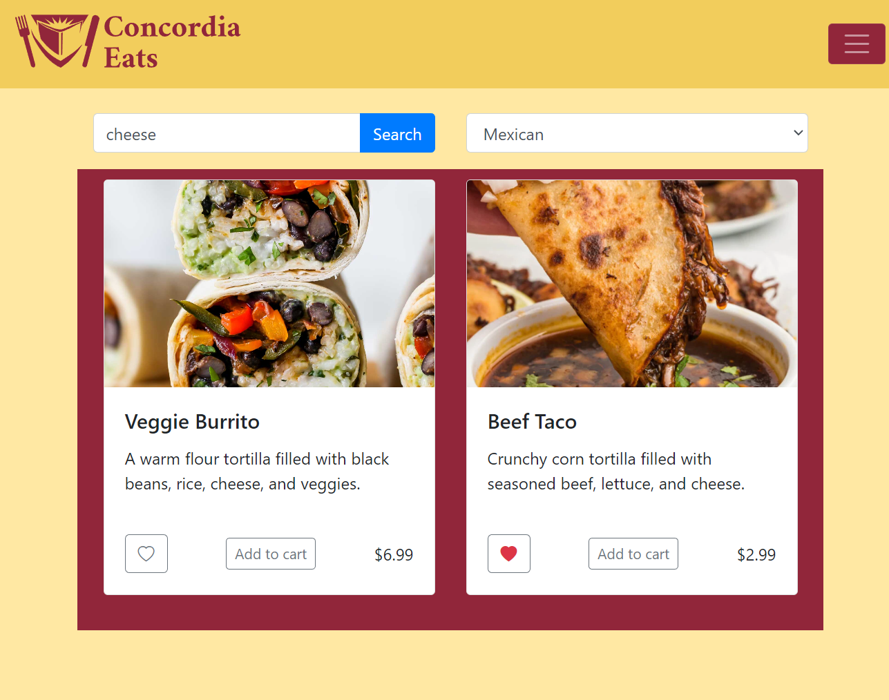
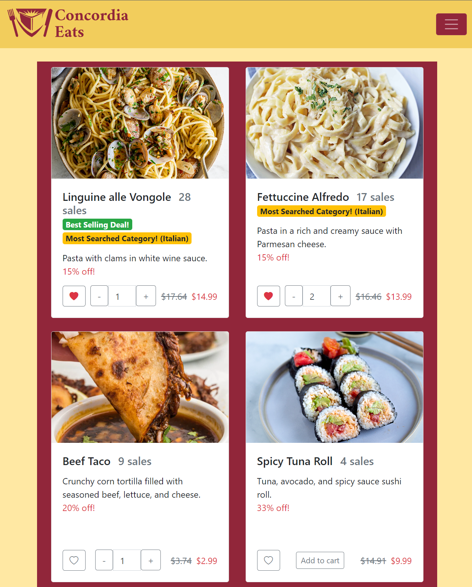
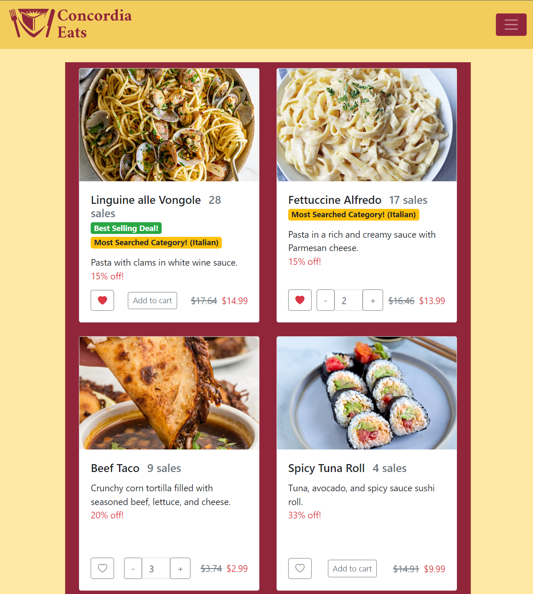
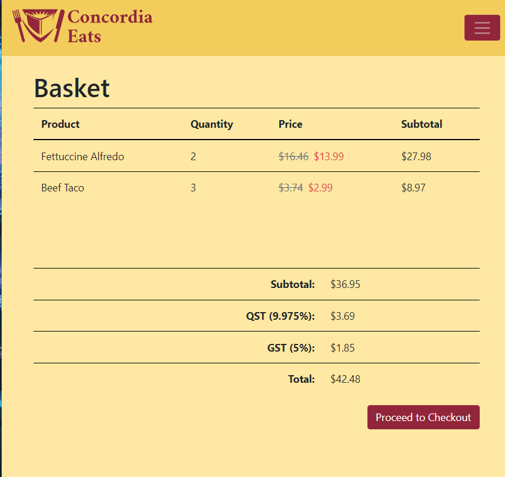
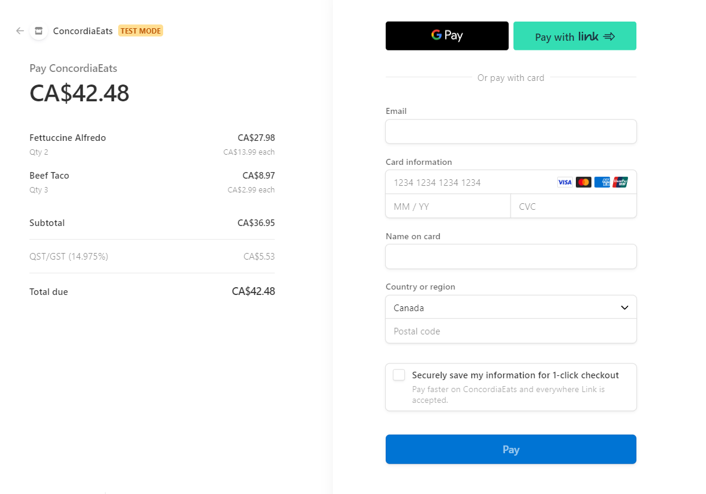
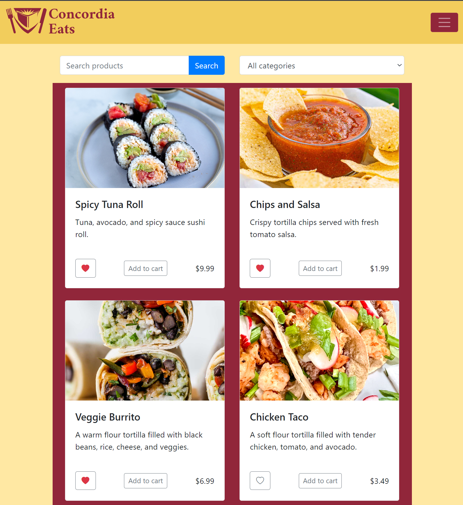
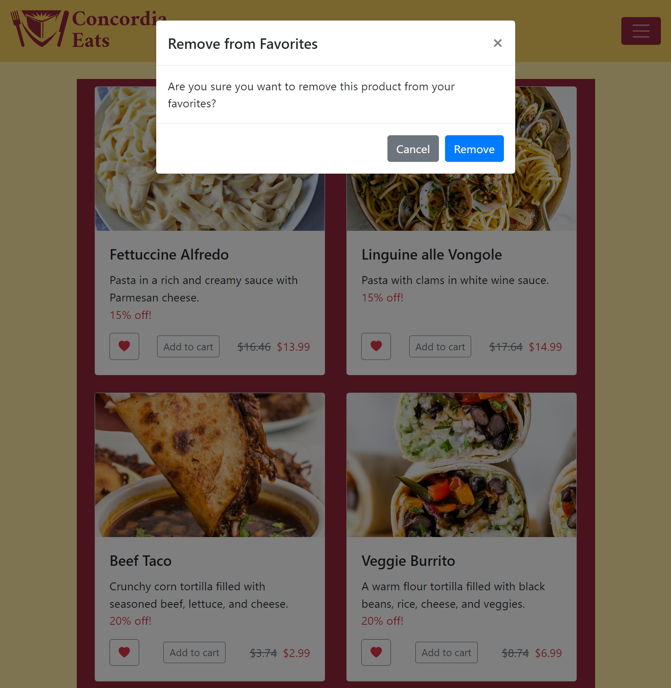
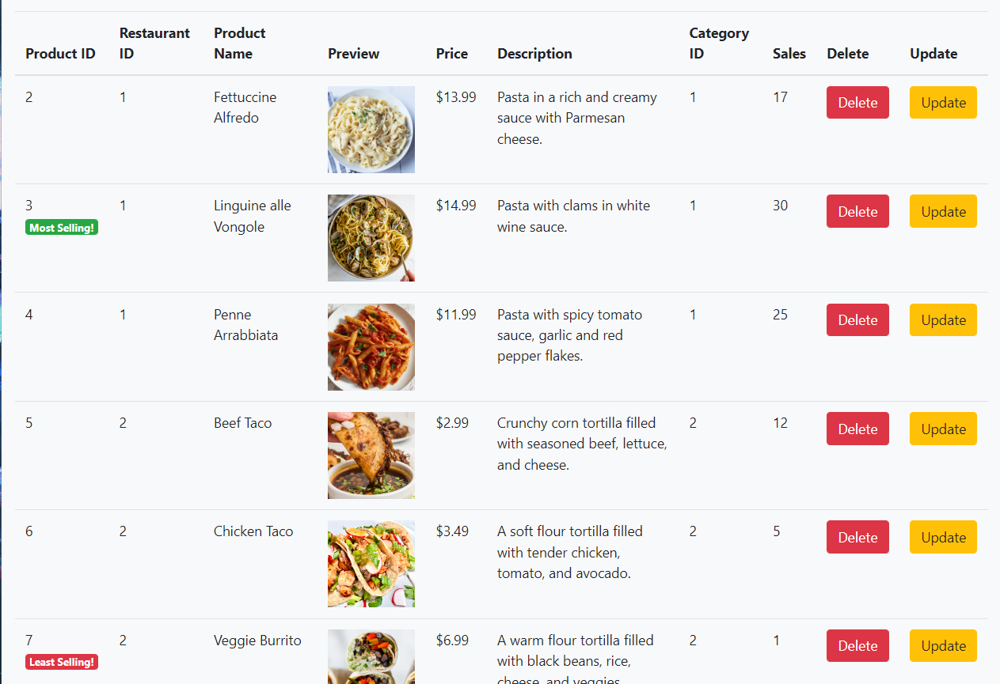
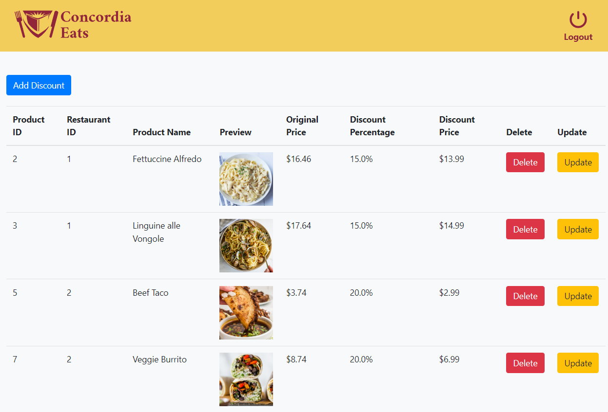
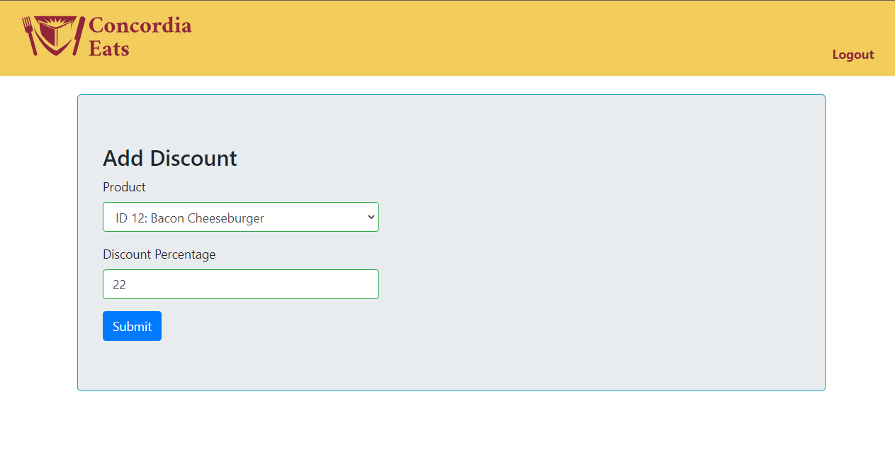

# ConcordiaEats

## Forked from [E-commerce-project-springBoot](https://github.com/jaygajera17/E-commerce-project-springBoot)

# Features Added:
##  Food Items Categories and Search: 
  * Food items are available in their categories and can be easily searched using filters.
  * Products are indexed and queried by [Algolia API](https://www.algolia.com/doc/guides/getting-started/quick-start/tutorials/quick-start-with-the-api-client/java/?client=java)
  * Products are searchable by category, product name, and descriptions.

    

##  Best Deals:
* Food items are recommended to customers based on:
  * Total sales by all customers
  * Search patterns (logged-in customer's most searched category).
  * Items in logged-in customer's favourites.
  * Discount percentage.

  

##  Basket:
* Food items can be added to the basket from:
  * Products Page
  * Search Page 
  * Favourites Page
  * Best Deals Page

  

* Once added to cart, users can review their order: 

  

* Finally, from the review basket page, users can proceed to checkout (powered using the [Stripe API):
  * To complete the order, use credit card number 4242 4242 4242 4242 with MM/YY 04/24 and CVC 424
  * Once this is done, a transaction record is generated in the SQL Transactions table for future analytics.

  

##  Favourites Tab/Section:
* Food items can be added to a users' favourites tab (sustained after log-outs) from:
  * Products Page
  * Search Page
  * Best Deals Page

  

* Food items can be removed from a users' favourites tab from:
  * Favourites Page
  * Products Page
  * Search Page
  * Best Deals Page

  

##  Sales Analytics from the Admin Products Panel:
* Products panel now displays the most selling and least selling items:

  

## Sales and Discounts Management for Admins:
* Admins can now manage products that are on sale from the admin dashboard.

  

  

# How To Run ?

## Install IntelliJ Ultimate Edition (free with a student email address)

## Import the Project into IntelliJ Ultimate

## Make sure to install all Maven Dependencies (important, project won't run otherwise)
* To do this, go to the Maven tab on the far right side of the window.
* Then, click on the refresh incon titled "Reload all maven projects".

# Contributors: 
* Anushree Anjanappa (40192958): Admin Implementation
* Hussein Barakat (40256036): Back-End Implementation
* John Mark (25449790): Report, Admin Implementation
* Nanditha Arunachalam (40254301): Front-End Implementation
* Pascal Spiegler (40135616): Back-End & Front-end Implementation/GitLab set-up
* Pavitha Maheswaran (40034502): Unit testing/Report
* Pritam Kumar Pratihari (40205864): Unit testing
* Opening Tickets in Kanban Board: All team members

# References:

* Open-source code partially referenced to implement shopping cart: https://github.com/reljicd/spring-boot-shopping-cart

